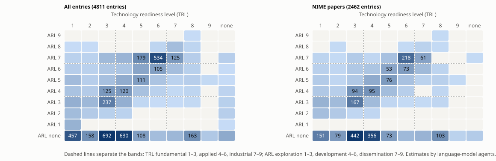

## Abstract

The NIME proceedings and the off-NIME archive together hold 3936 entries: 3020 from the NIME conference (2001–2026) and 916 from earlier and concurrent publications (1955–2013). This report asks how complete the two archives are as a record of the field, measured by what their papers cite and what cites them. From 45908 references parsed out of 2366 paper texts, and from Semantic Scholar's forward citations, there are 12596 citation links between archive entries. 748 works are cited by at least five archive papers but held by neither archive, and 1209 works outside NIME cite at least five archive entries. Further lists rank papers as NIME-related but missing: 338 in a local archive of conference proceedings, 1029 from a sweep of 19 journals and conference series, the music papers of six ACM proceedings and the Zenodo communities of open music-technology conferences, and 298 found by snowballing from the reference lists of the Cited works. Together they are a curation queue for extending off-NIME backwards, sideways and past its current end in 2013. An [interactive atlas](../atlas/) of the papers, authors and citations accompanies the report.

## Data

The NIME side is the `NIME-bibliography` repository: 2448 papers, 488 music entries, 70 installation entries and 14 alt entries. Papers carry abstracts, and many carry keywords. The off-NIME side is this repository: 94 Computer Music Journal entries, 255 ICMC entries, 531 ISIDM entries and 36 extras. Off-NIME entries carry titles but no abstracts. Classified by where they were published, the off-NIME entries fall into these channels:

| Channel | Entries |
|---|---|
| ICMC | 253 |
| Other conference proceedings | 122 |
| Computer Music Journal | 106 |
| Books | 102 |
| Other journals | 86 |
| Book chapters | 36 |
| Organised Sound | 33 |
| Theses | 32 |
| IRCAM publications | 23 |
| CHI / HCI | 21 |
| Leonardo | 19 |
| AES | 17 |
| Contemporary Music Review | 17 |
| Technical reports | 14 |
| Journal of New Music Research | 12 |
| Sound and Music Computing | 7 |
| SIGGRAPH / graphics | 7 |
| Acoustical Society | 4 |
| Gesture workshops | 3 |
| DAFx | 2 |

Paper texts came from three places. 2366 NIME paper PDFs were downloaded from nime.org and reduced to text, keeping no PDF. 24 early NIME papers whose PDFs have broken font encodings were read from OCR copies in a local archive of conference proceedings. 21 curated off-NIME ICMC papers were matched to local ICMC PDFs by year, first author and title. Semantic Scholar was queried by DOI and found 1966 of the 2448 NIME papers (80.3%) and 260 off-NIME entries.

## Method

Authors are keyed on surname and first initial, with accents removed, so that "Marcelo M. Wanderley" and "M. Wanderley" are one node; the cost is that a few different people share a key. Topics come from a non-negative matrix factorisation (16 components) of TF-IDF vectors over title, keywords and abstract, fitted on papers only and then applied to the concert and installation notes. The paper map is a t-SNE projection of the same vectors; it also places the works of the datasets built around the archives (Cited, Related, Theses, Background, Historical and Zotero), which take their topics from the fitted model without shaping it. The co-author and citation networks are laid out with ForceAtlas2; the co-author network's small components are packed in a band below its main component.

References were read from each paper's PDF with GROBID, a machine-learning tool for scholarly documents, run locally; GROBID returned references for 2332 papers. For the others, references were split from the text's last References heading on numbered markers, or on author–year line starts where there are none. Either way, they were matched to the archives on a title key (significant words run together, 32 letters) or on the archive title appearing in the reference string. Unmatched references were clustered on the same key. 5266 references (11.5%) yielded no usable title.

Entries with a DOI but no readable text (the NIME papers of 2021 and 2022, which are on PubPub and not on Zenodo, and most of the off-NIME archive) take their reference lists from OpenAlex instead: 281 entries, giving 1255 links into the archives and 3908 references to other works. OpenAlex records that are whole proceedings volumes (79) are skipped, since a link to a volume says nothing about which paper is cited. A chapter cited in an edited book also counts as a citation of the book when the book's own references name its editors and its title is not a venue name; this adds 68 citations, for example of A NIME Reader.

Two checks bound the parser's quality. A parsed link from a paper to one published more than a year later must be wrong; of 11967 parsed links, 3 do so. Recall was measured against the 724 links that Semantic Scholar's own reference lists give for papers the parser also read: the parser finds 87.8% of them. Splitting the plain text alone found about half of these links, mostly because pdftotext interleaves the two columns of a page and breaks references in half. The citation network therefore merges the parsed links with Semantic Scholar's links in both directions.

What each entry offers the analysis differs by dataset. The table gives the share of entries with a full text that the scripts could read, an abstract, and a reference list (from GROBID, the text, or OpenAlex); [`collection.csv`](output/collection.csv) gives the three for every entry.

| Dataset | Entries | Full text | Abstract | Reference list |
|---|---:|---:|---:|---:|
| NIME papers | 2448 | 97% | 96% | 98% |
| ISIDM | 531 | 0% | 27% | 27% |
| Zotero | 507 | 0% | 27% | 0% |
| NIME music | 488 | 4% | 86% | 2% |
| Cited | 443 | 0% | 31% | 0% |
| Theses | 409 | 0% | 93% | 0% |
| ICMC | 255 | 8% | 7% | 7% |
| Related | 195 | 0% | 4% | 0% |
| Background | 110 | 0% | 31% | 0% |
| CMJ | 94 | 0% | 54% | 74% |
| NIME installations | 70 | 6% | 83% | 0% |
| Historical | 60 | 0% | 0% | 0% |
| Extras | 36 | 0% | 14% | 17% |
| NIME alt | 14 | 0% | 100% | 0% |

Semantic Scholar holds the NIME papers but returns their reference lists elided at the publisher's request; only 141 entries came with references. Forward citations are not elided, and they give the second candidate list.

The local conference archive was scored separately. Each of its 1339 paper texts (ICMC, DAFx, SMC, ISMIR, ICMPC and workshops; duplicates, programme books and whole volumes removed) is represented by its first page and scored by its mean cosine similarity to its ten nearest archive entries, leaving out a paper's own archive entry where it has one. As a check that the score can fail, the 44 curated off-NIME ICMC papers present locally were scored in the same way. They rank at a median percentile of 73.6 among 685 ICMC texts, and 50.0% of them fall in the top quarter, against 50 and 25 by chance. A candidate is listed as above threshold when it scores at least as high as the lowest quarter of the curated papers.

A sweep through Crossref, Zenodo, HAL (for JIM) and SBC OpenLib (for SBCM) covered every article in ACM Transactions on Computer-Human Interaction, CIM (Colloquio di Informatica Musicale), CMMR, Computer Music Journal, Computer Music Multidisciplinary Research, Contemporary Music Review, DAFx, ISMIR, International Conference on Live Coding, JIM (Journées d'Informatique Musicale), Journal of New Music Research, Leonardo Music Journal, Nordic Sound and Music Computing, Organised Sound, Personal and Ubiquitous Computing, SBCM (Brazilian Symposium on Computer Music), Sound and Music Computing, TENOR (music notation) and Web Audio Conference, and music-related papers in the CHI, TEI, Audio Mostly, MOCO, DIS and Creativity and Cognition proceedings: 18357 research articles of at least four title words, 8267 of them with an abstract. Short titles such as record and product reviews score high on closeness alone, since they share common words with everything, so these articles are scored by contrast: closeness to the archives minus closeness to the rest of the sweep. Here the check is the 101 Computer Music Journal articles already curated into off-NIME. They rank at a median percentile of 75.2 among 1623 CMJ articles, and 50.5% fall in the top quarter. A candidate needs at least the curated median contrast and at least the curated lower-quartile closeness, so that general HCI articles far from the music-heavy sweep do not pass on contrast alone.

The works on the backward list were looked up in Crossref by title, first author and year, accepting a hit whose title matches at a ratio of at least 0.9 and whose year is within two. 394 of 748 (52.7%) were found; the rest have no Crossref record, as with arXiv preprints and older conference papers, or titles parsed too poorly to match.

## Results

### Two archives, few shared authors

The archives have 4457 authors between them: 1034 in off-NIME and 3720 in NIME. Only 297 (6.7%) appear in both. 3064 authors (68.7%) have a single entry. The co-author network has 8262 links, and its largest connected component holds 2567 authors (57.6%); the atlas shows the 1393 authors with at least two entries. The authors who bridge the two archives are, unsurprisingly, the founding generation of the conference:

| Author | Off-NIME | NIME | First entry |
|---|---|---|---|
| Marcelo M. Wanderley | 26 | 80 | 1996 |
| Joseph A. Paradiso | 18 | 28 | 1996 |
| Perry R. Cook | 14 | 13 | 1989 |
| David Wessel | 9 | 8 | 1979 |
| Haruhiro Katayose | 11 | 7 | 1993 |
| Sidney S. Fels | 7 | 17 | 1994 |
| Roger B. Dannenberg | 6 | 14 | 1984 |
| Julius O. Smith | 6 | 12 | 1992 |
| Adrian Freed | 6 | 18 | 1991 |
| Atau Tanaka | 5 | 21 | 1991 |
| Matthew Wright | 5 | 29 | 1994 |
| Antonio Camurri | 11 | 5 | 1986 |

### Topics

| # | Strongest terms | Off-NIME | NIME |
|---|---|---|---|
| 1 | interaction, collaborative, process, experience, composition, musicians | 100 | 566 |
| 2 | computers dance, environments, dancing, dance movement, analysis, motion sensing | 90 | 67 |
| 3 | gestures, gesture recognition, space, gesture analysis, hand, expressive gesture | 47 | 93 |
| 4 | virtual reality, virtual environments, immersive, presence, physical, virtual environment | 64 | 143 |
| 5 | midi controller, controllers, foot controller, gestural controller, alternative, baton | 35 | 141 |
| 6 | parameters, sounds, model, physical, models, timbre | 66 | 245 |
| 7 | sensors, sensor, wireless, software, processing, motion | 73 | 233 |
| 8 | input devices, input device, evaluation input, expression, mobile, human-computer interaction | 70 | 146 |
| 9 | installation, network, sonic, multimedia, robotic, space | 25 | 185 |
| 10 | mapping strategies, mappings, gestures, instrumental, controllers, parameters | 57 | 167 |
| 11 | live coding, live electronics, programming, composition, graphical, audio-visual | 52 | 253 |
| 12 | machine learning, neural, model, models, training, algorithms | 44 | 231 |
| 13 | media, language, philosophy, understanding, reader, revisited | 37 | 93 |
| 14 | keyboard, piano, touch, modular, polyphonic, continuous | 42 | 77 |
| 15 | haptic feedback, physical, force feedback, tactile feedback, vibrotactile feedback, haptics | 46 | 270 |
| 16 | synthesizer, program, play, inexpensive, synthesizers, voice | 27 | 73 |

Shares are mean topic weights per five-year period. In the off-NIME archive, the earliest period (1975–1979) is dominated by synthesizer, program (22.2%) and parameters, sounds (17.8%). In NIME, from 2000–2004 to 2025–2029, the largest rises are in interaction, collaborative (11.4% to 23.3%) and machine learning, neural (4.0% to 10.6%), and the largest falls in midi controller, controllers (13.2% to 2.5%) and sensors, sensor (11.5% to 6.5%). The trends tab in the atlas shows every topic and period. I would treat the topic model as a map for browsing rather than a finding, since off-NIME entries have titles only.

### Citations between the archives

Of the 12596 citation links, 8704 go from NIME to NIME and 2987 from NIME to off-NIME, so 25.5% of NIME's links into the archives point to off-NIME. In the other direction, 222 links go from off-NIME entries to NIME papers and 683 within off-NIME. The off-NIME figures are low because few off-NIME texts were available to parse, not because those papers cite little. The most cited entries within the archives are:

| Title | Year | Channel | Cited by |
|---|---|---|---|
| Problems and Prospects for Intimate Musical Control of Computers | 2002 | Computer Music Journal | 144 |
| Principles for Designing Computer Music Controllers | 2001 | NIME | 121 |
| The importance of Parameter Mapping in Electronic Instrument Design | 2002 | NIME | 106 |
| New digital musical instruments: control and interaction beyond the keyboard | 2006 | Books | 98 |
| Input Devices for Musical Expression : Borrowing Tools from HCI | 2001 | NIME | 90 |
| Trends in Gestural Control of Music | 2000 | Books | 88 |
| Evaluation of Input Devices for Musical Expression: Borrowing Tools from HCI | 2002 | Computer Music Journal | 80 |
| The E in NIME: Musical Expression with New Computer Interfaces | 2006 | NIME | 65 |
| Mapping performer parameters to synthesis engines | 2002 | Organised Sound | 60 |
| Design for Longevity: Ongoing Use of Instruments from NIME 2010-14 | 2017 | NIME | 57 |
| Contexts of Collaborative Musical Experiences | 2003 | NIME | 56 |
| Mapping Strategies for Musical Performance | 2000 | IRCAM publications | 51 |
| Towards a Model for Instrumental Mapping for Expert Musical Performance | 2000 | ICMC | 51 |
| Of Epistemic Tools: Musical Instruments as Cognitive Extensions | 2009 | Organised Sound | 50 |
| Gestural Control of Sound Synthesis | 2004 | Other conference proceedings | 50 |

### What is missing: three lists

The first list holds works that archive papers cite but neither archive holds, in [`candidates_cited.bib`](output/candidates_cited.bib) (748 works cited at least five times, 394 with a DOI). These are the foundations the archives leave out: protocols and languages, books on embodiment and gesture, HCI theory, and later NIME-adjacent journal articles.

| Cited by | First author | Year | Title |
|---|---|---|---|
| 87 | wright | 1997 | Open Sound Control: A New Protocol for Communicating with Sound Synthesizers |
| 65 | jordà | 2007 | The reacTable: exploring the synergy between live music performance and tabletop tangible interfaces |
| 51 | leman | 2007 | Embodied Music Cognition and Mediation Technology |
| 42 | mccartney | 2002 | Rethinking the Computer Music Language: SuperCollider |
| 40 | braun | 2006 | Using thematic analysis in psychology |
| 40 | mcpherson | 2015 | An environment for submillisecond-latency audio and sensor processing on beaglebone black |
| 40 | jensenius | 2017 | A NIME Reader-Fifteen years of New Interfaces for Musical Expression |
| 38 | dourish | 2001 | Where the Action Is: The Foundations of Embodied Interaction |
| 38 | frid | 2019 | Accessible Digital Musical Instruments-A Review of Musical Interfaces in Inclusive Music Practice |
| 37 | barbosa | 2003 | Displaced soundscapes: A survey of network systems for music and sonic art creation |
| 37 | kapur | 2005 | A history of robotic musical instruments |
| 37 | caillon | 2021 | RAVE: A variational autoencoder for fast and high-quality neural audio synthesis |
| 37 | wright | 2005 | Open Sound Control: an enabling technology for musical networking |
| 35 | mcpherson | 2010 | The magnetic resonator piano: Electronic augmentation of an acoustic grand piano |
| 34 | magnusson | 2019 | Sonic Writing: Technologies of Material, Symbolic, and Signal Inscriptions |
| 33 | lewis | 2000 | Too Many Notes: Computers, Complexity and Culture in Voyager |
| 32 | pachet | 2003 | The Continuator: Musical Interaction With Style |
| 32 | jensenius | 2010 | Musical gestures: concepts and methods in research |
| 31 | o'modhrain | 2000 | Playing by Feel: Incorporating Haptic Feedback into Computer-Based Musical Instruments |
| 31 | jordà | 2005 | Digital Lutherie Crafting musical computers for new musics' performance and improvisation |
| 30 | small | 1998 | Musicking: The Meanings of Performing and Listening |
| 29 | cook | 1999 | The Synthesis ToolKit (STK) |
| 29 | collins | 2006 | Handmade Electronic Music: The Art of Hardware Hacking |
| 29 | collins | 2003 | Live coding in laptop performance |
| 28 | scipio | 2003 | ‘Sound is the interface’: from interactive to ecosystemic signal processing |
| 28 | godøy | 2010 | Musical Gestures: Sound, Movement, and Meaning |
| 27 | norman | 1990 | The Design of Everyday Things |
| 27 | waters | 2007 | Performance Ecosystems: Ecological approaches to musical interaction |
| 26 | ishii | 1997 | Tangible bits: towards seamless interfaces between people, bits and atoms |
| 25 | schloss | 2003 | Using Contemporary Technology in Live Performance: The Dilemma of the Performer |

The second list holds works outside NIME that cite at least five archive entries, in [`candidates_citing.tsv`](output/candidates_citing.tsv) (1209 works, 572 of them without a venue in Semantic Scholar, which mostly means theses). These are the continuation of the field outside its own proceedings: PhD theses, journal reviews, books and courses.

| Cites | Year | Title | Venue |
|---|---|---|---|
| 76 | 2026 | A Design Space for Live Music Agents | International Conference on Human Factors in Computing Systems |
| 59 | 2019 | New Directions in Music and Human-Computer Interaction | Springer Series on Cultural Computing |
| 58 | 2016 | Body as instrument : an exploration of gestural interface design |  |
| 57 | 2012 | Interactive music: Balancing creative freedom with musical development. |  |
| 53 | 2015 | Computed fingertip touch for the instrumental control of musical sound with an excursion on the computed retinal afterimage | arXiv.org |
| 48 | 2019 | Musical Instruments for Novices: Comparing NIME, HCI and Crowdfunding Approaches | New Directions in Music and Human-Computer Interaction |
| 46 | 2017 | Mobile Devices as Musical Instruments - State of the Art and Future Prospects | Computer Music Modeling and Retrieval |
| 46 |  | A Scale-Based Ontology of Digital Musical Instrument Design |  |
| 45 | 2016 | Creativity, exploration and control in musical parameter spaces |  |
| 42 | 2013 | Methods and Technologies for Analysing Links Between Musical Sound and Body Motion |  |
| 40 | 2011 | Advances in new interfaces for musical expression | International Conference on Computer Graphics and Interactive Techniques |
| 40 | 2009 | Creating new interfaces for musical expression: introduction to NIME | SIGGRAPH Courses |
| 39 | 2015 | How to design and build new musical interfaces | IFIP TC13 International Conference on Human-Computer Interaction |
| 39 | 2014 | How to design and build musical interfaces | SIGGRAPH ASIA Courses |
| 39 | 2013 | Creating new interfaces for musical expression | SIGGRAPH ASIA Courses |
| 38 | 2017 | Modeling, recognition of finger gestures and upper-body movements for musical interaction design |  |
| 38 | 2019 | Designing Digital Musical Instruments Using Probatio | Computational Synthesis and Creative Systems |
| 38 | 2017 | Score instruments : a new paradigm of musical instruments to guide musical wonderers |  |
| 37 | 2005 | Digital lutherie - crafting musical computers for new musics' performance and improvisation |  |
| 36 | 2016 | Apps, Agents, and Improvisation: Ensemble Interaction with Touch-Screen Digital Musical Instruments |  |

The third list holds papers in the local conference archive that score as NIME-related but are in neither archive, in [`candidates_local.tsv`](output/candidates_local.tsv) (338 above threshold, 229 of them from ICMC). Titles are guessed from the first page and need checking.

| Score | Set | Year | Title (guessed from the first page) |
|---|---|---|---|
| 0.301 | ICMC | 2008 | DEVELOPMENT OF A REAL-TIME GESTURAL INTERFACE FOR HANDS-FREE MUSICAL PERFORMANCE CONTROL |
| 0.268 | ICMC | 2008 | DEVELOPMENT OF A REAL−TIME GESTURAL INTERFACE FOR HANDS−FREE MUSICAL PERFORMANCE CONTROL |
| 0.262 | ICMC | 2005 | TOWARDS AN AUTOMATED MUSIC TEACHING SYSTEM: AUTOMATIC RECOGNITION OF MUSICAL |
| 0.261 | ICMC | 2008 | DO MOBILE PHONES DREAM OF ELECTRIC ORCHESTRAS? Henri Penttinen |
| 0.244 | ICMC | 2005 | DESIGNING AND IMPLEMENTING THE CHUCK PROGRAMMING LANGUAGE Perry R. Cook† Ananya Misra |
| 0.229 | ICMC | 2000 | An Expressive Synthesis Model for Bowed String Instruments Tapio Takala 1, Jarmo Hiipakka 1,3, Mikael Laurson  |
| 0.226 | ICMC | 2008 | Research Staff Michael Alcorn Michael Alcorn’s compositional interests lie at the intersection |
| 0.226 | ICMC | 2008 | SCORING THE COLOR OF WAITING Margaret Schedel |
| 0.226 | ICMC | 2001 | Data driven identification and computer animation of bowed string model |
| 0.223 | DAFx | 2006 |  |
| 0.219 | ICMC | 2000 | Influence of Attack Parameters on the Playability of a Virtual Bowed String Instrument |
| 0.216 | GestureWorkshop | 2003 | A Video System for Recognizing Gestures by Artificial Neural Networks for Expressive Musical Control |
| 0.213 | ICMC | 2001 | An Audio-Driven Perceptually Meaningful Timbre Synthesizer Tristan Jehan, Bernd Schoner∗ |
| 0.212 | ICMC | 2001 | Real Time Extended Physical Models for the Composer and Performer |
| 0.210 | ICMC | 2000 | Qualitative and Quantitive Assessment of a Virtual Bowed String Instrument |

The fourth list holds journal and proceedings papers that score as NIME-related, in [`candidates_journals.bib`](output/candidates_journals.bib) (1029 papers: 134 from Sound and Music Computing, 128 from CHI, 128 from Audio Mostly, 110 from Computer Music Journal, 84 from Personal and Ubiquitous Computing, 73 from Contemporary Music Review, 67 from Journal of New Music Research, 64 from ISMIR, 48 from CMMR, 25 from DAFx, 23 from Leonardo Music Journal, 21 from MOCO, 21 from International Conference on Live Coding, 21 from SBCM (Brazilian Symposium on Computer Music), 20 from JIM (Journées d'Informatique Musicale), 15 from TEI, 11 from Organised Sound, 8 from DIS, 8 from Computer Music Multidisciplinary Research, 8 from Creativity and Cognition, 7 from CIM (Colloquio di Informatica Musicale), 2 from ACM Transactions on Computer-Human Interaction, 2 from TENOR (music notation), 1 from Web Audio Conference).

| Score | Source | Year | Title |
|---|---|---|---|
| 0.247 | CHI | 2009 | Audio or tactile feedback |
| 0.230 | MOCO | 2014 | Non-tactile Gestural Control in Musical Performance |
| 0.198 | ISMIR | 2007 | A Demonstration of the SyncPlayer System. |
| 0.174 | Computer Music Journal | 2001 | From Dance! to “Dance”: Distance and Digits |
| 0.171 | CHI | 2026 | MoXaRt: Audio-Visual Object-Guided Sound Interaction for XR |
| 0.168 | Contemporary Music Review | 1991 | The UPIC as a performance instrument |
| 0.167 | Journal of New Music Research | 2002 | The Basics of Scratching |
| 0.154 | CMMR | 2014 | Vibrotactile Feedback for an Open Air Music Controller |
| 0.147 | MOCO | 2024 | DanceCraft: A Music-Reactive Real-time Dance Improv System |
| 0.141 | Computer Music Journal | 2020 | Electronic_Khipu_: Thinking in Experimental Sound from an Ancestral Andean Interface |
| 0.131 | CHI | 2007 | The sound of touch |
| 0.131 | CHI | 2008 | The sound of touch |
| 0.128 | Journal of New Music Research | 2018 | Symbaline: An electromagnetically actuated wine glass instrument |
| 0.126 | JIM (Journées d'Informatique Musicale) | 2024 | VIVO: Video Analysis for Corpus-based Audio--Visual Synthesis |
| 0.122 | Contemporary Music Review | 2019 | Choreography in R. Murray Schafer's The Crown of Ariadne—Technical or Theatrical? |
| 0.121 | DAFx | 2001 | Expressive Controllers For Bowed String Physical Models |
| 0.120 | Computer Music Journal | 1986 | Elementi di Informatica Musicale |
| 0.119 | DAFx | 2001 | TONETABLE: A Multi-User, Mixed-Media, Interactive Installation |
| 0.115 | DIS | 2023 | Unlogical instrument: Material-driven gesture-controlled sound installation |
| 0.115 | International Conference on Live Coding | 2020 | Disabled Approaches to LiveCoding, Cripping the Code |

The fifth list comes from two rounds of snowballing. 329 of the 443 Cited works have reference lists in Crossref, and [`candidates_snowball.tsv`](output/candidates_snowball.tsv) holds the 298 works that at least 3 of them cite and that neither archive nor Cited holds. Proceedings and journal names are not counted as works, and a work cited both by DOI and by title is counted once. A second round starts from the 91 round-1 works with a DOI and a NIME-topic probability of at least 0.5; 72 of them have reference lists, and only 11 works that they cite are new to both the collection and the first round ([`candidates_snowball2.tsv`](output/candidates_snowball2.tsv)). The literature around the archives is close to closed under citation at this depth.

| Cited by Cited works | Year | First author | Title |
|---|---|---|---|
| 25 | 2007 | M Leman | Embodied music cognition and mediation technology |
| 17 | 1978 | JJ Gibson | The Ecological Approach to the Visual Perception of Pictures |
| 14 |  |  | Using thematic analysis in psychology |
| 12 |  |  | Ambiguity as a resource for design |
| 12 | 2007 | Magnusson | The acoustic, the digital and the body |
| 8 | 1998 | C Small | Musicking: The meanings of performing and listening |
| 8 | 2005 | Collins N. | Audio Engineering Society Convention |
| 8 |  |  | Too Many Notes: Computers, Complexity, and Culture in Voyager |
| 8 | 2000 | Blaine | The Jam-O-Drum interactive music system |
| 8 | 2019 | Frauenberger | Entanglement hci the next wave? |
| 8 |  |  | Design: Cultural Probes |
| 8 | 2015 | Katan | Using Interactive Machine Learning to Support Interface Development Through Workshops with Disabled People |
| 8 | 2011 | Fiebrink | Human model evaluation in interactive supervised learning |
| 8 | 2005 | Latour B. | Reassembling the Social:An Introduction to Actor-Network-Theory: An Introduction to Actor-Network-Theory |
| 8 |  |  | Spectromorphology: Explaining Sound-Shapes |

### Non-English proceedings

JIM and SBCM records are scored by their English title and abstract, which the repositories often give beside the original: 261 of 823 JIM papers and 131 of 131 SBCM papers have English text. The rest are listed unscored in [`candidates_nonenglish_unscored.tsv`](output/candidates_nonenglish_unscored.tsv). SBC OpenLib holds only the recent SBCM editions; the earlier SBCM proceedings (from 1994) and all CIM proceedings (1979–2024, from the AIMI website) are whole-volume PDFs, split into papers at their Abstract, Sommario or Riassunto headings: 222 SBCM and 495 CIM papers. The SBCM volumes from 1994 to 1998 are scans, read by OCR in English only, since the Portuguese language pack is not installed. Only papers with English text are scored.

### The Related dataset

The candidates from the sweep are too mixed to publish as they stand: a reading of sampled titles found many off topic (compilers, game audio, music recommendation). A strict tier, with contrast at least the upper quartile of the curated CMJ articles and closeness at least their median, held few off-topic titles in a second reading. [`bibs/Related/related.bib`](../bibs/Related/related.bib) holds the 195 papers of that tier that Cited and Theses do not already hold, with one copy of any title found in two venues. The website shows them under a Related tab.

### Books

Books were searched in Crossref (34 queries for books, edited volumes and monographs). They rarely carry abstracts, so they are judged by the title classifier, after two filters learnt from reading the results: the title must name music or sound and must also name technology, since musicology, instrument history and encyclopedia entries otherwise dominate. Of 390 books that pass the filters, 93 with a NIME-topic probability of at least 0.8 join the Related dataset as book entries; the full list is [`candidates_books.tsv`](output/candidates_books.tsv). Books that the archives cite, such as Sound Actions and A NIME Reader, are in Cited.

### The Historical dataset

The reference parser reads years back to 1700 when a reference has no later year, and finds 111 works from before 1955 cited by archive papers, from Hornbostel and Sachs to Fitts. Most are general science or psychology; those on musical instruments, their classification and electronic or mechanical sound production form the Historical dataset, together with standard precursors that papers name without always citing in full (Mersenne, Helmholtz, Cahill's Telharmonium patent, Busoni, Theremin's patent). The cut-off is 1957, the year of the first MUSIC program. Of the 60 works, 29 are cited by archive papers and 13 are patents. Each is checked against Crossref (articles, which gives the DOI), Open Library (books) or Google Patents (patents, which gives the title and issue year); 47 pass, and the rest carry a note asking for vetting. The seed list is in `tools/historical_seeds.txt` and the cited works in `candidates_historical.tsv`.

### The Zotero dataset

The maintainer's Zotero library was matched against the whole collection by DOI and title key, and the unmatched works were scored by the title classifier. Among them are 527 works with a scholarly item type, a year, and either a NIME-topic probability of at least 0.9 or a NIME tag or folder in the library (4 works qualify by the tag or folder alone). Short titles, which have no title key, match on the whole title within a year. Of these, 10 have titles that are not in English, where the classifier is unreliable, and 10 match an entry already in the collection under a variant title (the same year within one, and the first 60 letters of the title agreeing by a ratio of at least 0.8). Works that name the NIME proceedings as their venue are left out, since the NIME archive holds them. The remaining 507 form [`bibs/Zotero/zotero.bib`](../bibs/Zotero/zotero.bib), each with its probability in a note, for vetting; 67 of them carry the library's topical tags as keywords, without the tags that record reading or filing. The check is `tools/zotero_check.py`; it needs the library, so it is skipped elsewhere.

### Theses

PhD and master's theses were collected separately, since they dominate the forward list and are poorly covered by the journals. They come from six sources:

- 98 NIME-related queries to OpenAlex (works of type dissertation) and DataCite (Dissertation and Thesis records);
- a DataCite title lookup of the untyped works on the forward list;
- OpenAlex dissertations that cite archive works: 2125 archive works were found in OpenAlex by DOI, and 1007 dissertations cite at least one of them, 184 at least three;
- OpenAlex dissertations by the 724 authors with at least 2 archive works, written from 3 years before their first archive work to 6 years after their last, since a doctoral thesis tends to follow its author's papers: 255 dissertations;
- the same queries, and 15 in French, to theses.fr, the French national catalogue, for defended theses, with the English title and abstract where the record has them: 3036 theses;
- the 290 theses in the maintainer's Zotero library that the collection lacks.

Together they gave 19864 distinct theses, of which 1866 are not in English and are listed separately for the non-English sources ([`candidates_theses_non_english.tsv`](output/candidates_theses_non_english.tsv)).

Thresholds borrowed from the journal sweep admitted too few theses, since thesis abstracts read differently from article abstracts, so the thresholds are calibrated on the 34 English theses on the forward list: closeness and contrast both at their median. The OpenAlex dissertations that cite archive works are a looser population and are not used for calibration. Closeness and contrast alone let in general HCI, web and music-education theses, so every admitted thesis also needs a NIME-topic probability of at least 0.7 from the title classifier. A thesis is admitted when it passes both thresholds or cites at least three archive entries. As a check on a separate population, the searches found 9 of the 32 theses already in off-NIME, and the rules would admit 6 of them (66.7%). A reading of sampled titles still found some general HCI and virtual-reality theses among those that cite the archives, close to the archives' HCI side. The rules also pass 2 theses that are excluded by hand: their French titles score high with the classifier, but they are about plant ecology and medicine.

A thesis that several sources found counts once, under the source whose record was kept (the one with the longest abstract).

| Source | Theses | Admitted |
|---|---:|---:|
| OpenAlex | 13981 | 264 |
| theses.fr | 3036 | 24 |
| DataCite | 1799 | 40 |
| OpenAlex (citing) | 724 | 60 |
| Zotero | 228 | 20 |
| OpenAlex (author) | 96 | 3 |

[`bibs/Theses/theses.bib`](../bibs/Theses/theses.bib) holds the 409 admitted theses, 143 of which cite at least three archive entries, and the website shows them under a Theses tab. The full scored list is [`candidates_theses.tsv`](output/candidates_theses.tsv).

### Technology and artistic readiness

Every entry in both archives and in the four rule-selected datasets, 5660 in all, carries an estimated technology readiness level (TRL, 1–9, grouped as fundamental 1–3, applied 4–6 and industrial 7–9) and an estimated artistic readiness level (ARL, 1–9, Jensenius's scale from initial artistic impulse to demonstrated artistic impact, grouped as exploration, development and dissemination), with a confidence and a one-line reason. The estimates were made by language-model agents reading title, venue and abstract against a fixed rubric ([`trl_rubric.md`](tools/trl_rubric.md)); 1606 of them rest on a title alone. They are estimates, not measurements.

Three expectations from the rubric hold: 96.8% of the NIME concert and installation entries reach ARL 7 or more, 80.0% of the Background works sit at TRL 1–3, and 52.0% of the NIME papers have no artistic component. Among NIME papers, the fundamental share falls from 56.7% in 2000–2004 to 45.0% in 2020–2024, and the applied share rises from 34.8% to 45.2%. Agreement with a human reader has not yet been measured: [`trl_validation_sheet.tsv`](output/trl_validation_sheet.tsv) holds 30 random entries to label. [ARJ: label the 30 entries with your own TRL and ARL, so that agreement can be reported.] The heatmap shows two clusters and a band between them: research papers with no artistic component, mostly at TRL 3–4; concert and installation works at ARL 7, mostly at TRL 5–7; and papers that develop technology and artistic practice together, with ARL 3–6 at TRL 3–5. 218 NIME papers sit at TRL 6 and ARL 7, papers that present an instrument together with a performed work. The estimates are in [`trl_arl.tsv`](output/trl_arl.tsv) and in the collection export, and the paper map can be coloured by either scale.

### Data quality

The off-NIME archive holds 5 pairs of entries that share a title. Each pair is two publications: a conference paper and its journal version, reports in two issues of a journal, or two different papers with the same title.

| Entry | Same title as | Title |
|---|---|---|
| off-nime:czeiszperger92 | off-nime:tanaka90 | CyberArts International |
| off-nime:Buxton1978 | off-nime:buxton1978sssp | An Introduction to the SSSP Digital Synthesizer |
| off-nime:BosiLocalization1990 | off-nime:bosi90 | An Interactive Real-time System for the Control of Sound Localization |
| off-nime:wanderley2004gestural | off-nime:gibet1990gestural | Gestural Control of Sound Synthesis |
| off-nime:bromberg2004adapt | off-nime:bromberg2002adapt | ADaPT: Telepresent Artistic Collaborations |

3 titles occur in both archives. These are different publications of the same work, a NIME paper followed by a journal version, and both entries should stay.

| NIME entry | Off-NIME entry | Title |
|---|---|---|
| nime:nime2001_Wessel | off-nime:wessel2002intimate | Problems and Prospects for Intimate Musical Control of Computers |
| nime:nime2001_Ulyate | off-nime:ulyate2002interactive | The Interactive Dance Club : Avoiding Chaos In A Multi Participant Environment |
| nime:nime2008_KimBoyle | off-nime:kimboyle2009network | Network Musics --- Play , Engagement and the Democratization of Performance |

## Expanding the archives

I would extend off-NIME along the three directions the lists measure, and in this order.

1. Vet the Cited and Background datasets and the borderline list. Works with a DOI, in neither archive, that are cited by at least 5 archive papers, cite at least 10 archive entries, or turned up in the journal sweep as well as on one of those lists, are sorted by whether they are about NIME topics. Most of them have only a title in Crossref, and a title alone cannot be judged by the similarity scores, so a title classifier decides: trained on the archive titles against titles from general HCI, music scholarship and music information retrieval, it is right on 87.6% of held-out titles (AUC 0.94). `bibs/Cited/cited.bib` holds the 443 works it judges to be about NIME topics, among them Sound Actions and A NIME Reader. `bibs/Background/background.bib` holds 110 works that many archive papers cite but that are not about NIME topics, such as Barad, Braun and Clarke, Fitts and Small. From titles alone the classifier makes visible mistakes, putting a paper on gender in new music interface technology in Background and The Physics of Musical Instruments in Cited, so both lists need a human reading. [`borderline.tsv`](output/borderline.tsv) lists 419 more. [ARJ: read Cited and Background, and move what is on the wrong side.]
2. Use the forward list to continue off-NIME past 2013. Its top entries are mostly theses and journal articles that position themselves against NIME. The Crossref sweep gives a systematic list alongside the citation-driven one, and the two can be read together: an article that appears in both is a strong candidate.
3. Mine the local archive. ICMC 2000–2008 is present locally in full, and the score shortlists 229 ICMC papers. The full ICMC archive at the University of Michigan library, and ICMC's listing in DBLP, both sit behind bot checks, so they cannot be read by a script. [ARJ: ask the ICMA or Michigan Publishing for a metadata export of the ICMC proceedings (recommended), or extend the local copy year by year?]
4. Snowball. Each accepted candidate brings its own reference list; repeating the citation step until a round yields few new works cited by five or more archive papers would close the backward list.
5. Give every off-NIME entry a DOI or Semantic Scholar identifier, and an abstract where one exists. Topic modelling and citation matching both suffer most from titles-only entries. The Semantic Scholar title lookup is in `tools/fetch_s2.py` and resumes from its cache, but it needs an API key to finish in reasonable time. [ARJ: request a Semantic Scholar API key (recommended), or use OpenAlex's free daily allowance over several days?]
6. Decide where the result lives. The off-NIME site and the NIME bibliography share a format; a joined export with an `archive` field, as `data/corpus.json` already is, would let the NIME website show both. [ARJ: propose this to the IDMIL maintainers as a pull request (recommended), or keep it in this fork for now?]

### Exports

The joined collection, with the NIME proceedings, the off-NIME archive and the Cited dataset, is exported as [`collection.csv`](output/collection.csv) for spreadsheets and as CSL-JSON in [`collection.json`](output/collection.json), which Zotero, Mendeley and pandoc import directly. Each of its 5660 entries names its archive and dataset and, for archive entries, its strongest topic.

## Limitations

Author keys merge people who share a surname and initial, and split people who publish under different initials. The reference parser misses 12.2% of the links that Semantic Scholar finds, so counts in the backward list are lower bounds and rank works by how often they are cited in papers whose text parsed well. The forward list depends on Semantic Scholar's coverage, which is better for recent work. Titles in the third list are guessed from first pages. The topic model is fitted on uneven text: abstracts for NIME, titles for off-NIME.

## Data and code

The scripts are in `analysis/tools/` and run from `analysis/.venv` in this order: `build_corpus.py`, `fetch_s2.py`, `fetch_citing.py`, `fetch_texts.py`, `extract_local.py`, `parse_refs.py`, `citations.py`, `crossref.py`, `local_candidates.py`, `score_journals.py`, `build_cited.py`, `offnime_dois.py`, `analyse.py`, `export.py`, `build_viewer.py` and `report.py`; `run.sh` runs them in that order. Downloaded texts and caches are in `analysis/data/` and are not committed. The atlas is `analysis/output/nime-atlas.html`; the candidate lists are the three `.tsv` files beside it.

## Contributor roles

Alexander Refsum Jensenius: conceptualisation, resources (the local conference archive), supervision. The NIME bibliography is maintained by the NIME community; the off-NIME archive was built at IDMIL, McGill University, under Marcelo M. Wanderley, by João Tragtenberg, Kasey Pocius, Maxwell Gentili-Morin and Ian Doherty.

## AI disclosure

The scripts, the analysis and the draft of this report were produced with Claude Opus 5.5 (Anthropic) in Claude Code, working from the instructions of the author. Paper metadata and citation links come from the Semantic Scholar Academic Graph API.
